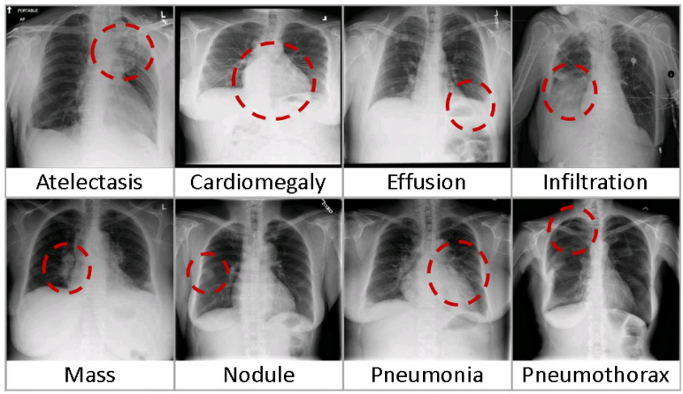

# Low-carbon, federated thorax disease classification

## Problem description
We examine the problem of training a machine learning (ML) model for thorax disease classification on chest X-Ray images, that are collected from patients of 100 hospitals, in 14 regions, around the world.
Since this data cannot be shared across the different entities because of data protection and bandwidth reasons (large amount of images produced by each hospital), we resolved to train our model using the framework of Federated Learning (FL) [[1]](#1). In essence, a Federated Learning training round consists of three steps:
1. Train the same copy of a ML model on each entities's data set for a set number of iterations
2. Send the locally updated weights to a central server and average them
3. Send the updated model to each entity

Due to large waiting times, that may result from the heterogenity of hardware/data resources and the internet access of each client, most FL applications use a <span style="color:red">random selection</span> of clients for each training round, irrespective of their access to clean energy wrt. CO2 emissions.

In our approach, we employ a smart optimization algorithm that results in a <span style="color:lightgreen">carbon-aware selection</span> of clients which reduces the Carbon emissions of the FL training to a max, without loss of client selection fairness(need to explain?) or performance.

## About the dataset
### National Institutes of Health (NIH) Chest X-Ray Dataset
The NIH ChestX-ray dataset [[2]](#2) comprises 112,120 frontal-view X-ray images of 30,805 unique patients with the text-mined fourteen disease image labels (where each image can have multi-labels), mined from the associated radiological reports using natural language processing. Fourteen common thoracic pathologies include Atelectasis, Consolidation, Infiltration, Pneumothorax, Edema, Emphysema, Fibrosis, Effusion, Pneumonia, Pleural_thickening, Cardiomegaly, Nodule, Mass and Hernia.
## Results
Show results of CO2 savings using flower. Compare 2 training traces, one using random client selection and one using Flower.s
# How to run the experiment yourself
### TODO: Update experiment structure and explain here briefly.
### Installations
Install the FL framework ***Flower***

`pip install flwr`

Install low-carbon Plugin for the Flower framework

`pip install flwr-lowcarbon`

### Download the data
The dataset can be downloaded directly from the official NIH app.box directory:\
https://nihcc.app.box.com/v/ChestXray-NIHCC
\
Or, through the corresponding Kaggle challenge site:\

https://www.kaggle.com/datasets/nih-chest-xrays/data\
If you want to download the data set through the Kaggle cli, first make sure that you have your Kaggle token in the following directory:\
```/home/.kaggle/kaggle.json```\
before running the following terminal command:\
```kaggle datasets download -d nih-chest-xrays/data```

## References
<a id="1">[1]</a> 
McMahan et al. (2016).\
Communication-efficient Learning of Deep Neural Networks.\
https://arxiv.org/abs/1602.05629
\
\
<a id="2">[2]</a> 
Wang et al. (2017)\
ChestX-ray8: Hospital-scale Chest X-ray Database and Benchmarks on Weakly-Supervised Classification and Localization of Common Thorax Diseases.\
https://arxiv.org/abs/1705.02315